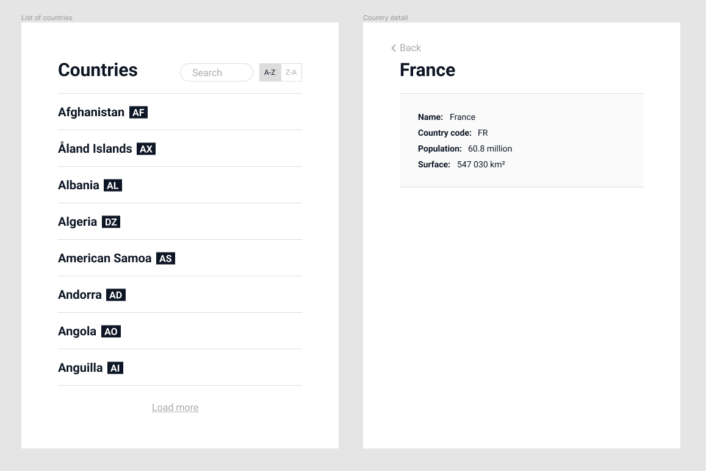

# Context

At Viceversa, we aim to provide a high-quality user experience all over
our application, even with simple lists/detail pages.

Your job is to create the interface of a country directory that supports
text search, sort, and infinite scroll pagination.

In addition to your code, a README explaining your thought process and
your choices would be appreciated.

# Exercise

-   Display the list of countries
    -   Allow the user to search and sort the list
    -   Allow the user to scroll through the list
-   Display the country detail page (using a separate front route)



Here is the [Figma file](https://www.figma.com/file/SiPUNLTh3QT9QDaVUnigwR/).

## Bonus 1

Make sure that stress-testing the UI won't break anything. E.g., if a
user types search queries, changes the sort order, and scrolls faster
than the server can respond, the app should be able to handle it and
display the right state in the end.

## Bonus 2

Our infrastructure could slow down or even crash (sh\*t happens
`¯\_(ツ)\_/¯`). Make sure the user can understand what is happening if
it's the case.

## Do you want to make the app even better?

Feel free to make as many improvements as you like.
We love creativity and technical challenges.

If you are out of ideas, here are some thoughts:

-   Our clients are professionals who use our app as a working tool.
    We try to save them time by removing repetitive actions. What if
    a user searches for "islands", clicks on a result to see its
    population, and uses the browser's history back button to go
    back to the list?

# API

You can start the API server using:

```
$ cd ./api
$ npm run start
```

You can then use it on [localhost:1337](http://localhost:1337) and see
the [Swagger documentation](http://localhost:1337/documentation/).

# Client

The `./client` directory is all yours.
